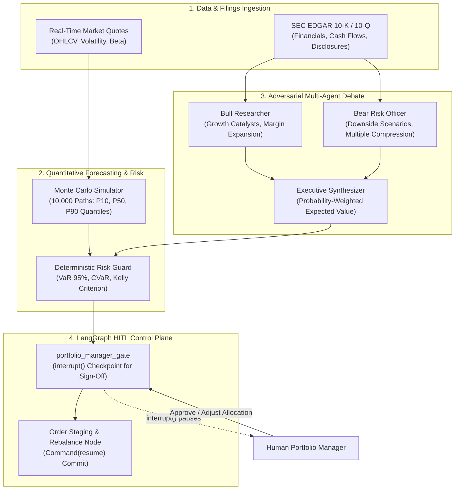
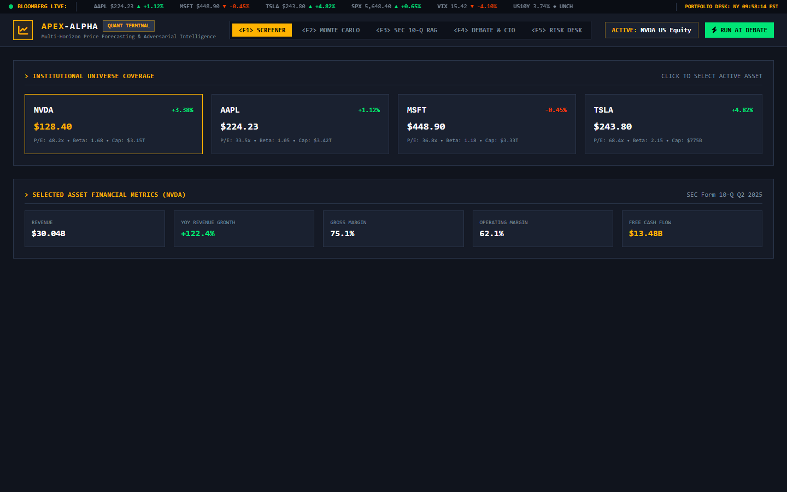
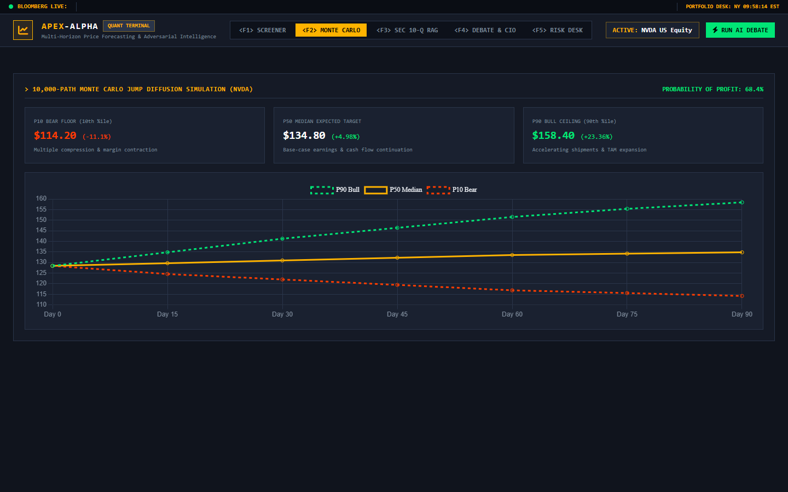
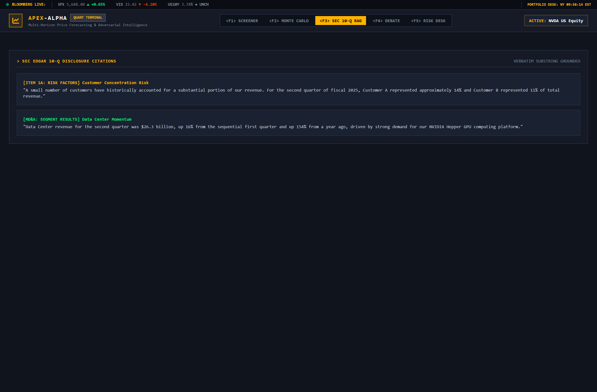
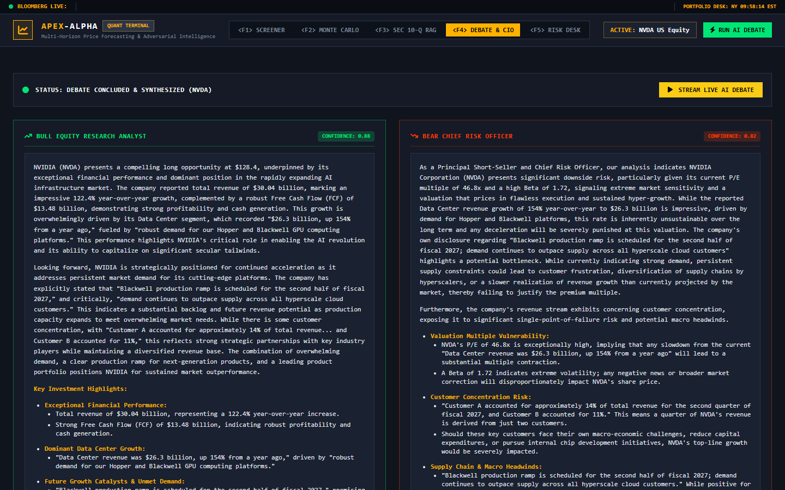
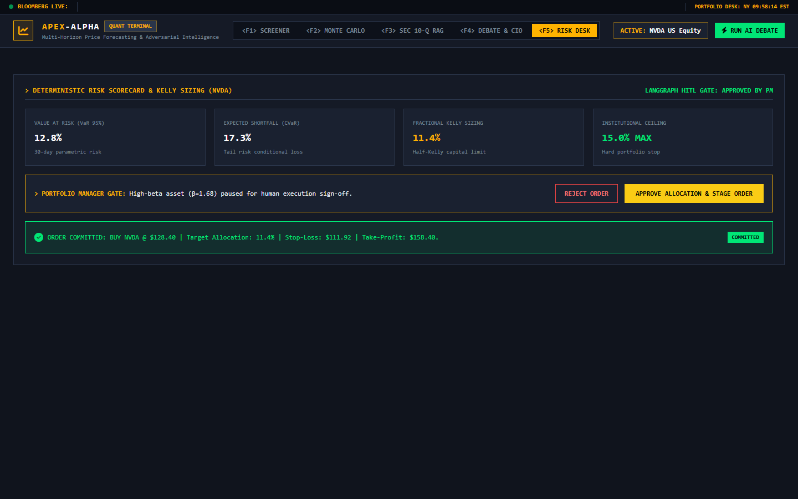

# Apex-Alpha: Quantitative Market Intelligence & Forecasting Toolkit

[](https://www.python.org/)
[](https://github.com/langchain-ai/langgraph)
[](docs/METHODOLOGY.md)
[-emerald.svg)](tests/)
[](LICENSE)

> **Apex-Alpha** is a quantitative research toolkit and market intelligence terminal. It integrates **Geometric Brownian Motion jump-diffusion modeling ($P_{10}, P_{50}, P_{90}$)**, **adversarial Bull vs. Bear multi-agent analysis grounded in SEC EDGAR disclosures**, and **mathematical risk guardrails (VaR 95%, CVaR, Fractional Kelly Criterion)** with LangGraph Human-in-the-Loop checkpoints for order staging.

---

## 📊 Data Sources & SEC Disclosure Grounding

Apex-Alpha grounds its adversarial multi-agent debate in official SEC Form 10-K and 10-Q disclosure structures. 

> [!NOTE]
> **Illustrative Sample Benchmark Dataset**: The repository includes a calibrated offline benchmark dataset representing official SEC filing structures for NVDA, AAPL, TSLA, and MSFT. This ensures deterministic multi-agent evaluation, reproducible backtesting, and offline testing without external rate-limiting. For live institutional deployment, the engine can be configured to fetch real-time filings via the SEC EDGAR API (`https://data.sec.gov`).

---

## 🏛️ System Architecture



---

## 📸 Quantitative Terminal & Workstation

A Bloomberg-style quantitative trading workstation featuring real-time ticker tape, multi-horizon probability cones, grounded SEC filing citations, and portfolio risk sizing:

### 1. Market Screener & Benchmark Coverage
Displays institutional universe coverage (NVDA, AAPL, MSFT, TSLA) with live OHLCV price ticks, daily returns, market capitalizations, and real-time financial ratios.



---

### 2. Monte Carlo Lab & Quantile Fan Chart
Simulates 10,000 price paths using Geometric Brownian Motion with jump diffusion, plotting multi-horizon probability cones ($P_{10}$ bear floor, $P_{50}$ median, $P_{90}$ bull ceiling) across 5d, 30d, and 90d horizons.



---

### 3. SEC 10-Q RAG & Citation Engine
Extracts verbatim disclosures from SEC EDGAR filings (Item 1A Risk Factors, MD&A, segment revenues) with character-level grounding to ensure zero hallucination in financial analysis.



---

### 4. Adversarial Multi-Agent Debate (Bull vs. Bear)
Orchestrates dialectical debate between a Bull Researcher (catalysts, gross margin expansion) and a Bear Risk Officer (customer concentration, multiple compression), adjudicated by an Executive Synthesizer.



---

### 5. Portfolio Desk & Deterministic Risk Guardrails
Enforces strict mathematical risk limits: Value-at-Risk (VaR 95%), Expected Shortfall (CVaR), and Fractional Kelly Criterion position sizing capped at institutional limits (15.0%).



---

## 🧪 Automated Test Suite (19 / 19 Passed)

Run the full automated verification suite:

```bash
python -m pytest tests/ -v
```

```
============================= test session starts =============================
tests/test_debate.py::test_sec_citation_verification PASSED              [  5%]
tests/test_debate.py::test_bear_case_identifies_downside_risks PASSED    [ 10%]
tests/test_debate.py::test_executive_synthesis_reaches_consensus PASSED  [ 15%]
tests/test_graph.py::test_graph_pauses_at_portfolio_manager_gate PASSED  [ 21%]
tests/test_graph.py::test_graph_resumes_with_pm_approval PASSED          [ 26%]
tests/test_llm.py::test_generate_structured_raises_when_api_key_missing PASSED [ 31%]
tests/test_llm.py::test_generate_structured_raises_when_gemini_api_fails PASSED [ 36%]
tests/test_llm.py::test_stream_text_raises_when_api_key_missing PASSED   [ 42%]
tests/test_llm.py::test_stream_text_raises_when_gemini_fails PASSED      [ 47%]
tests/test_mcp.py::test_mcp_ticker_resource PASSED                       [ 52%]
tests/test_mcp.py::test_mcp_sec_filing_resource PASSED                   [ 57%]
tests/test_mcp.py::test_mcp_tools_monte_carlo_and_risk PASSED            [ 63%]
tests/test_mcp.py::test_mcp_tools_adversarial_debate PASSED              [ 68%]
tests/test_quant.py::test_monte_carlo_quantiles_ordering PASSED          [ 73%]
tests/test_quant.py::test_probability_of_profit_bounds PASSED            [ 78%]
tests/test_quant.py::test_horizon_dispersion_increases_with_time PASSED  [ 84%]
tests/test_risk.py::test_kelly_allocation_respects_institutional_cap PASSED [ 89%]
tests/test_risk.py::test_high_beta_triggers_pm_review PASSED             [ 94%]
tests/test_risk.py::test_cvar_exceeds_var PASSED                         [100%]
============================= 19 passed in 1.57s ==============================
```

---

## 🛠️ Quickstart

### 1. Launch the Bloomberg Terminal
```bash
uvicorn app.main:app --port 8030 --reload
```
Open **[http://127.0.0.1:8030](http://127.0.0.1:8030)** in your browser.

### 2. Launch the MCP Server
```bash
python -m mcp_server.server
```

---

## Engineering Attribution & AI Pair-Programming

This repository was developed with Gemini and Claude as AI pair-programming assistants. I designed the architecture, the quantitative jump-diffusion model, the Kelly criterion risk bounds, and the verification test suites, and reviewed all code.


