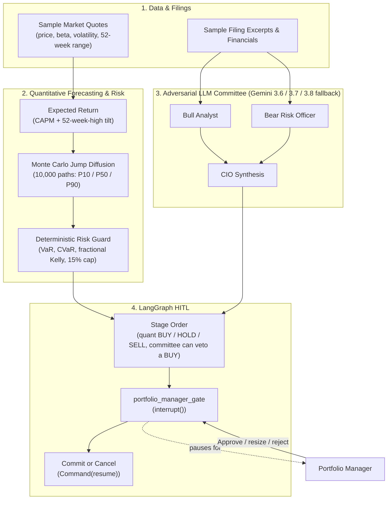
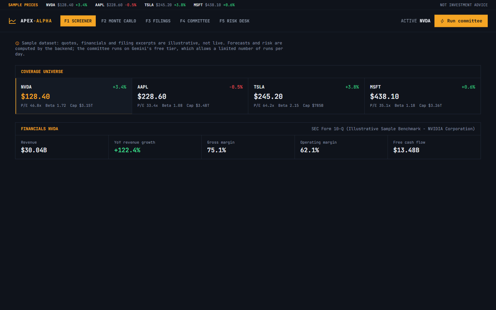
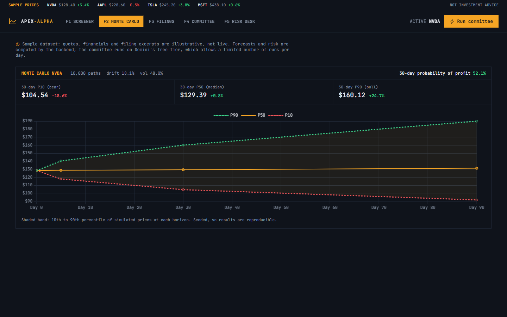
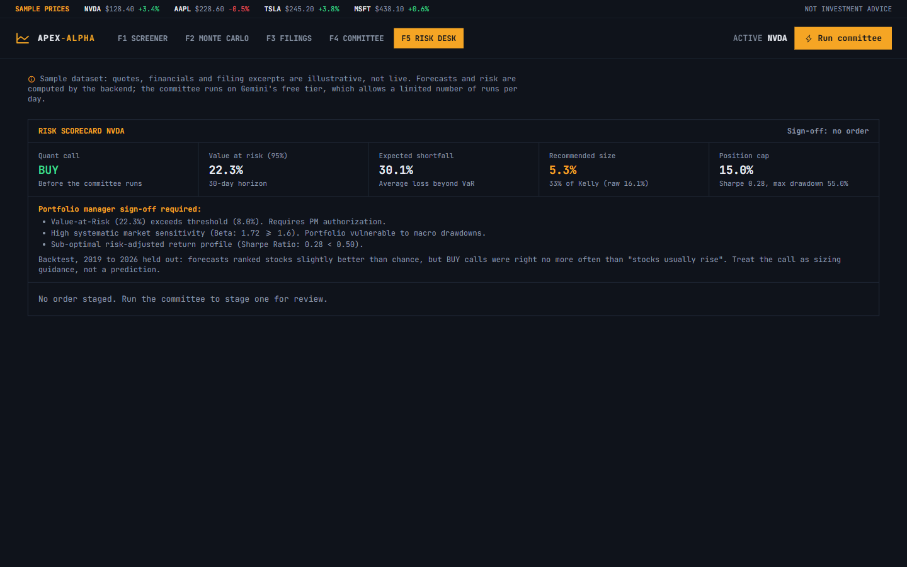

# Apex-Alpha: Quantitative Market Intelligence & Forecasting Toolkit

[](https://github.com/varadganjoo/apex-alpha/actions/workflows/ci.yml)
[](https://www.python.org/)
[](https://github.com/langchain-ai/langgraph)
[](docs/METHODOLOGY.md)
[](LICENSE)

> **Apex-Alpha** is a quantitative research terminal. A **Merton jump-diffusion Monte Carlo** engine produces 5, 30 and 90-day price quantiles; a **deterministic risk engine** sizes positions with fractional Kelly and VaR limits; an **adversarial Bull vs. Bear LLM committee** argues the case from filing excerpts; and a **LangGraph `interrupt()`** holds every staged order for a portfolio manager's sign-off.

**Live demo:** https://apex-alpha-tan.vercel.app (sample data; the committee runs on Gemini's free tier, so it is limited to a small number of runs per day)

> [!NOTE]
> **Sample dataset.** Quotes, financials and filing excerpts for NVDA, AAPL, TSLA and MSFT are illustrative benchmark data, not live market data. The backtest below uses real historical prices.

---

## Does it predict? The backtest

The quant BUY / HOLD / SELL rule is scored walk-forward on real prices: 32 large-cap US stocks, 2011 to 2026, one non-overlapping call every 30 trading days, using only data available at the time. Parameters were chosen on 2011-2018; 2019 onward was held out. Full tables and caveats are in [backtest/RESULTS.md](backtest/RESULTS.md).

| Held out, 2019-2026 | Rank IC | BUY hit rate (base rate 60.5%) | BUY-only CAGR (equal-weight 26.1%) |
| :--- | ---: | ---: | ---: |
| Original model (`0.12 / beta` drift, uncompensated jumps) | -0.117 | 59.0% | 3.0% |
| Current model (CAPM + 52-week-high reversal tilt) | **+0.071** | 60.5% | 22.0% |

What this says, plainly:

* The original simulator added about -12.6% a year of hidden drift. Its calls were **anti-predictive**: the stocks it avoided outperformed the ones it bought.
* The current model **ranks** stocks slightly better than chance on data it never saw (rank IC +0.07, in line with its in-sample +0.078).
* Its **BUY / SELL calls do not beat the base rate**. With realistic expected returns almost every stock clears the Kelly threshold, so the call is BUY about 99.6% of the time. Treat the call as position-sizing guidance, not a prediction.

The LLM committee is not part of the backtest: it cannot be replayed without look-ahead, because the model has already seen what happened next.

---

## System Architecture



The UI streams each graph node as it finishes (`POST /api/tickers/{symbol}/analyze/stream`), shows whether every citation was found verbatim in the filing excerpts, and resumes the paused graph through `POST /api/tickers/{symbol}/resume`. A portfolio manager can shrink a position but never exceed the 15% cap.

---

## Screenshots







---

## Quickstart

```bash
pip install -r requirements.txt
cp .env.example .env          # add GEMINI_API_KEY
uvicorn app.main:app --port 8030 --reload
```

Open http://127.0.0.1:8030. `GEMINI_MODELS` sets the fallback order (default `gemini-3.6-flash,gemini-3.7-flash,gemini-3.8-flash`); each model has its own free-tier quota.

MCP server:

```bash
python -m mcp_server.server
```

Reproduce the backtest (downloads prices from Yahoo Finance, about 7 minutes):

```bash
pip install -r backtest/requirements.txt
python -m backtest.run_backtest && python -m backtest.report
```

---

## Tests

```bash
python -m pytest tests/ -v
```

Covers Monte Carlo quantiles, the risk engine and order rule, the LangGraph interrupt/resume lifecycle, the HTTP API (streaming, sign-off validation, error handling), the MCP server, and the Gemini fallback chain. CI runs the suite on every push.

---

## Engineering Attribution & AI Pair-Programming

This repository was developed with Gemini and Claude as AI pair-programming assistants. I designed the architecture, the quantitative jump-diffusion model, the Kelly criterion risk bounds, and the verification test suites, and reviewed all code.

## License

MIT, see [LICENSE](LICENSE).
