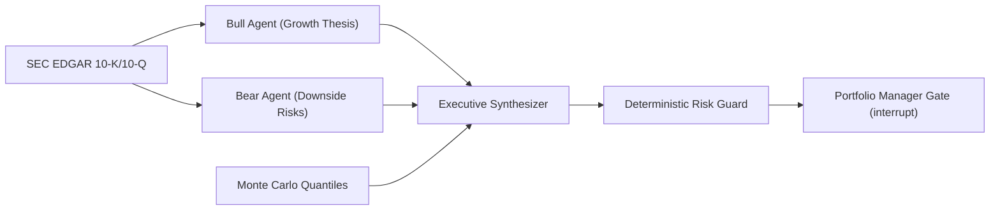

# Apex-Alpha: Quantitative Methodology & Risk Formulation

**Author**: Varad Ganjoo  
**Repository**: [github.com/varadganjoo/apex-alpha](https://github.com/varadganjoo/apex-alpha)  
**Date**: September 2026  

---

## 1. Mathematical Formulation

Quantitative forecasting in Apex-Alpha combines continuous-time stochastic modeling with fundamental SEC disclosure verification and deterministic portfolio risk constraints.

### 1.1 Asset Price Dynamics: Jump-Diffusion SDE

Continuous-time asset prices $S_t$ are modeled via Merton's Jump Diffusion stochastic differential equation (SDE):

$$\frac{dS_t}{S_{t^-}} = \mu dt + \sigma dW_t + (Y_t - 1) dN_t$$

where:
* $\mu \in \mathbb{R}$ is the annualized drift rate (expected return).
* $\sigma > 0$ is the continuous diffusion volatility, set so that diffusion plus jump variance equals the stock's total volatility: $\sigma^2 = \max(\sigma_{\text{total}}^2 - \lambda(\mu_J^2 + \sigma_J^2),\ 0.25\,\sigma_{\text{total}}^2)$.
* $W_t$ is a standard 1D Brownian motion ($dW_t \sim \mathcal{N}(0, dt)$).
* $N_t$ is a homogeneous Poisson process with jump intensity $\lambda \ge 0$, modeling discrete corporate earnings announcements or macro shocks.
* $Y_t$ is the log-normal jump amplitude: $\ln(Y_t) \sim \mathcal{N}(\mu_J, \sigma_J^2)$.

Integrating across discrete time step $\Delta t$:

$$S_{t + \Delta t} = S_t \exp\left( \left(\mu - \frac{1}{2}\sigma^2 - \lambda k\right)\Delta t + \sigma \sqrt{\Delta t} Z + \sum_{j=1}^{\Delta N_t} \ln(Y_j) \right)$$

where $k = \mathbb{E}[Y - 1] = \exp(\mu_J + \frac{1}{2}\sigma_J^2) - 1$ and $Z \sim \mathcal{N}(0, 1)$. The $-\lambda k$ term keeps the expected return equal to $\mu$ whatever the jump settings. Jumps are earnings-like: $\lambda = 4$ per year, $\mu_J = -1\%$, $\sigma_J = 5\%$.

> An earlier version of the simulator omitted $-\lambda k$ and used $\lambda = 0.05$ per *day*. That added roughly $-12.6\%$ a year of hidden drift and double-counted volatility, so every forecast leaned bearish and Kelly sizing was zero for every ticker. The backtest compares the two.

### 1.2 Expected Return (Drift)

$$\mu = r_f + \beta\,\text{ERP} + \theta\,(g - \bar g)$$

CAPM with $r_f = 4.5\%$ and an equity risk premium of $5.5\%$, plus an optional tilt on $g$, the distance from the 52-week high ($g = S/\max_{252} S - 1$, centered on its in-sample median $\bar g$). The tilt $\theta$ is chosen on 2011-2018 data only; see [backtest/RESULTS.md](../backtest/RESULTS.md).

### 1.3 Monte Carlo Quantile Cones

We generate $M = 10,000$ discretized price trajectories over horizons $T \in \{5, 30, 90\}$ trading days. The terminal distribution $\hat{F}_T(s) = \frac{1}{M} \sum_{m=1}^M \mathbf{1}_{\{S_T^{(m)} \le s\}}$ yields calibrated quantiles:

$$P_{10} = \hat{F}_T^{-1}(0.10), \quad P_{50} = \hat{F}_T^{-1}(0.50), \quad P_{90} = \hat{F}_T^{-1}(0.90)$$

---

## 2. Portfolio Risk & Kelly Guardrails

### 2.1 Value-at-Risk (VaR) & Expected Shortfall (CVaR)

Given portfolio returns $R \sim \mathcal{D}$ over holding period $\tau$:

$$\text{VaR}_\alpha(R) = -\inf \{ r \in \mathbb{R} : P(R \le r) > 1 - \alpha \}$$

$$\text{CVaR}_\alpha(R) = \mathbb{E}[-R \mid -R \ge \text{VaR}_\alpha(R)]$$

VaR is approximated from the simulated 30-day 10th percentile ($1.2 \times$ the P10 loss) and CVaR as $1.35 \times$ VaR. Portfolio Manager review is mandatory when VaR is at least $8\%$, beta is at least $1.6$, or the Sharpe ratio is below $0.5$.

### 2.2 Fractional Kelly Sizing

Position size uses the discrete Kelly criterion on the simulated 30-day distribution, with win probability $p = P(S_{30} > S_0)$ and payoff ratio $b = (P_{90} - S_0)/(S_0 - P_{10})$:

$$f = \min\left(\kappa \cdot \max\left(0, \frac{p\,b - (1 - p)}{b}\right),\ f_{\text{cap}}\right), \quad \kappa = 0.33,\ f_{\text{cap}} = 15\%$$

### 2.3 Buy / Hold / Sell Call

**BUY** when $f > 0$, **SELL** when $p < 45\%$, otherwise **HOLD**. The LLM committee can downgrade a BUY to HOLD when its stance is bearish but can never create a BUY. The quant rule is backtested; the committee veto is not.

---

## 3. Adversarial Multi-Agent Debate

The Bull and Bear agents are asked to quote the filing excerpts verbatim. Every returned citation is checked as a whitespace-normalized substring of the excerpts and shown as found or not found in the UI; unverified citations are flagged, not silently dropped.

---

## 4. Backtest

The BUY / HOLD / SELL rule is scored walk-forward on real prices in [`backtest/`](../backtest/). Full tables, setup and caveats: [backtest/RESULTS.md](../backtest/RESULTS.md).

---

## 5. Automated Verification

The architecture is covered by automated unit tests:
- **Quantile Ordering**: Validates $P_{10} < P_{50} < P_{90}$ across Monte Carlo simulations.
- **Dispersion Scaling**: Confirms the spread of $S_T$ widens with horizon.
- **Order Rule**: Checks the BUY / HOLD / SELL rule and that the committee can veto but not create a BUY.
- **Risk Invariants**: Validates that allocations respect the 15.0% institutional ceiling and high-beta assets trigger PM review gates.
- **Citation Integrity**: Verifies that Bull and Bear agents quote authentic filing substrings.
