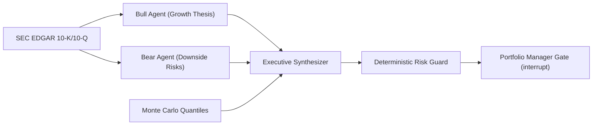

# Apex-Alpha: Quantitative Methodology & Risk Formulation

**Author**: Varad Ganjoo  
**Repository**: [github.com/varadganjoo/apex-alpha](https://github.com/varadganjoo/apex-alpha)  
**Date**: September 2026  

---

## 1. Mathematical Formulation

Quantitative forecasting in Apex-Alpha combines continuous-time stochastic modeling with fundamental SEC disclosure verification and deterministic portfolio risk constraints.

### 1.1 Asset Price Dynamics: Jump-Diffusion SDE

Continuous-time asset prices $S_t$ are modeled via Merton's Jump Diffusion stochastic differential equation (SDE):

$$\frac{dS_t}{S_{t^-}} = \mu dt + \sigma dW_t + (Y_t - 1) dN_t$$

where:
* $\mu \in \mathbb{R}$ is the annualized drift rate (expected return).
* $\sigma > 0$ is the continuous diffusion volatility.
* $W_t$ is a standard 1D Brownian motion ($dW_t \sim \mathcal{N}(0, dt)$).
* $N_t$ is a homogeneous Poisson process with jump intensity $\lambda \ge 0$, modeling discrete corporate earnings announcements or macro shocks.
* $Y_t$ is the log-normal jump amplitude: $\ln(Y_t) \sim \mathcal{N}(\mu_J, \sigma_J^2)$.

Integrating across discrete time step $\Delta t$:

$$S_{t + \Delta t} = S_t \exp\left( \left(\mu - \frac{1}{2}\sigma^2 - \lambda k\right)\Delta t + \sigma \sqrt{\Delta t} Z + \sum_{j=1}^{\Delta N_t} \ln(Y_j) \right)$$

where $k = \mathbb{E}[Y - 1] = \exp(\mu_J + \frac{1}{2}\sigma_J^2) - 1$ and $Z \sim \mathcal{N}(0, 1)$.

### 1.2 Monte Carlo Quantile Cones

We generate $M = 10,000$ discretized price trajectories over horizons $T \in \{5, 30, 90\}$ trading days. The terminal distribution $\hat{F}_T(s) = \frac{1}{M} \sum_{m=1}^M \mathbf{1}_{\{S_T^{(m)} \le s\}}$ yields calibrated quantiles:

$$P_{10} = \hat{F}_T^{-1}(0.10), \quad P_{50} = \hat{F}_T^{-1}(0.50), \quad P_{90} = \hat{F}_T^{-1}(0.90)$$

---

## 2. Portfolio Risk & Kelly Guardrails

### 2.1 Value-at-Risk (VaR) & Expected Shortfall (CVaR)

Given portfolio returns $R \sim \mathcal{D}$ over holding period $\tau$:

$$\text{VaR}_\alpha(R) = -\inf \{ r \in \mathbb{R} : P(R \le r) > 1 - \alpha \}$$

$$\text{CVaR}_\alpha(R) = \mathbb{E}[-R \mid -R \ge \text{VaR}_\alpha(R)]$$

At confidence level $\alpha = 0.95$, if $\text{VaR}_{0.95} > 15.0\%$, the position is flagged for mandatory Portfolio Manager review.

### 2.2 Fractional Kelly Sizing

Optimal position sizing is computed via the continuous Kelly Criterion with a conservative fractional multiplier ($\kappa = 0.33$) to protect against parameter estimation error and fat tails:

$$f^* = \kappa_{\text{safety}} \cdot \min\left( \frac{\mu - r_f}{\sigma^2}, \; f_{\text{cap}} \right)$$

where $\kappa_{\text{safety}} = 0.33$ and $f_{\text{cap}} = 15.0\%$.

---

## 3. Adversarial Multi-Agent Debate

The Bull and Bear agents are constrained by a verification invariant: any quantitative or structural assertion must cite a verifiable substring from the company's official SEC filings. If a claim lacks an authentic filing reference, it is discarded.

---

## 4. Quantitative Terminal & Workstation

A Bloomberg-style trading terminal provides real-time visualization of stochastic paths and risk metrics:

1. **Market Screener & Benchmark Coverage**:

2. **Monte Carlo Lab & Quantile Fan Chart**:

3. **SEC 10-Q RAG & Citation Engine**:

4. **Adversarial Multi-Agent Debate**:

5. **Portfolio Desk & Risk Guardrails**:

---

## 5. Automated Verification

The architecture is covered by automated unit tests:
- **Quantile Ordering**: Validates $P_{10} < P_{50} < P_{90}$ across Monte Carlo simulations.
- **Dispersion Scaling**: Confirms variance of $S_T$ scales with $\sqrt{T}$.
- **Risk Invariants**: Validates that allocations respect the 15.0% institutional ceiling and high-beta assets trigger PM review gates.
- **Citation Integrity**: Verifies that Bull and Bear agents quote authentic filing substrings.
